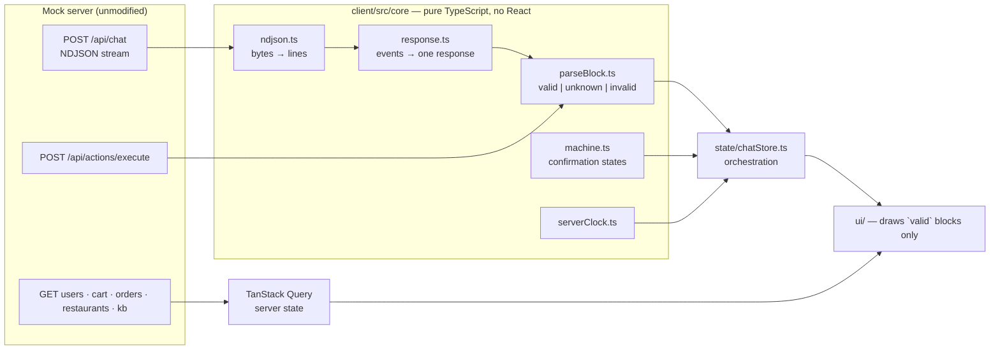
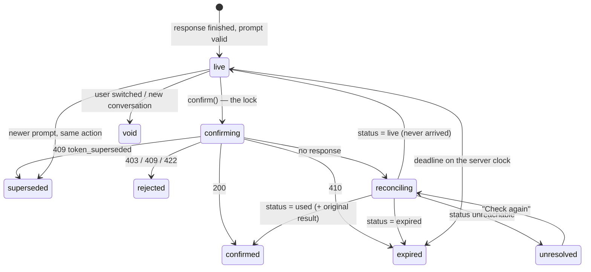

# Sofra — client for a model-driven interface

This is my submission for the Sofra frontend case study: the web client in
[`client/`](client/), built against the unmodified mock in `mock-server/`.
The original brief is kept verbatim in [`docs/case-brief.md`](docs/case-brief.md).



- [Run it](#run-it)
- [What is built](#what-is-built)
- [Architecture](#architecture)
- [Validation](#validation-and-why-it-is-done-this-way)
- [Confirmation lifecycle](#confirmation-lifecycle)
- [Untrusted content](#untrusted-content)
- [Server as the source of truth](#the-server-is-the-source-of-truth)
- [The interface](#the-interface)
- [Audit inspector](#audit-inspector-and-what-the-product-ui-shows)
- [Accessibility](#accessibility)
- [Tests](#tests)
- [Bonus work](#bonus-work)
- [Beyond the brief](#beyond-the-brief)
- [What the contract is missing](#what-the-contract-is-missing)
- [Assumptions](#assumptions-and-where-the-brief-and-the-mock-differ)
- [How I worked](#how-i-worked)
- [With more time](#with-more-time--what-changes-for-production)

## Run it

Node ≥ 20. Two terminals:

```bash
npm start                                   # the mock, http://localhost:4000
cd client && npm install && npm run dev     # the client, http://localhost:5173
```

| In `client/` | |
|---|---|
| `npm run dev` | the app; `?user=u_new` selects a user at load |
| `npm test` | 148 unit and component tests (Vitest), about a second |
| `npm run e2e` | the scenario table in a real browser (Playwright); starts both servers if they are not running. First time: `npx playwright install chromium` |
| `npm run lint` · `npm run typecheck` · `npm run build` | |
| `npm run capture` | regenerates `docs/screenshots/` |
| `http://localhost:5173/workbench.html` | every block in every state, no backend needed |

The client calls the mock directly (`VITE_API_URL`, default
`http://localhost:4000`). There is no dev proxy: the mock allows any origin and
exposes `X-Sofra-Now` and `Retry-After`, and a proxy would move the origin the
security payloads call back to.

## What is built

All seven must-haves, and all seven bonus items except one that needs a person
(see [Accessibility](#accessibility)).

| | |
|---|---|
| Streaming chat | NDJSON over `fetch`, Stop, send-while-streaming, `conversation_id` carried forward |
| Renderer | the nine catalog blocks, validated one by one; unknown skipped, invalid isolated |
| Confirmation | one state machine, exactly-once, server clock, supersede, reconcile |
| Shell | an account rail (user, address, wallet), a start screen, the cart and orders panel, all fed by REST and refreshed after every action |
| Safe content | markdown without HTML, link allowlist, no images; every other field is text |
| Audit inspector | drawer with audit record, stream phase and every validation failure |
| Tests | the eleven behaviours the brief lists, each pinned |
| Bonus | Playwright scenario table, resume after reload, help center, sources, workbench, performance note |

Screenshots of rows 4–9 are in [`docs/screenshots/`](docs/screenshots/)
(`npm run capture` regenerates them).

## Architecture

The brief says the code is read with one question: *where do the dangerous
decisions live, and how easy is it to get them wrong in the next change?* The
structure is my answer to it.

> Every decision that affects money or security lives in `client/src/core/`:
> plain TypeScript, no React, no store, no network. Each has one entry point
> and a test. React draws what that layer produces and can do nothing else.

[`client/src/core/README.md`](client/src/core/README.md) is the map: each
decision, the file it lives in, the test that pins it. Every file in `core/`
opens with the same two lines. An ESLint rule enforces the boundary (`core/`
cannot import React, the store or the API layer), and another forbids
`Date.now()` and `new Date()` everywhere in `src/`, because the only clock
that matters is the server's.

```
client/src/
  core/            framework-free; the dangerous decisions
    stream/        ndjson.ts      bytes → lines (split UTF-8, split lines)
                   events.ts      line → typed event
                   response.ts    events → one response (pure reducer)
    contract/      schemas.ts     the block catalog as strict Zod schemas
                   parseBlock.ts  unknown → valid | unknown | invalid
    confirmation/  machine.ts     the confirmation state machine
    clock/         serverClock.ts the only source of time
    markdown/      safeLink.ts    which link may be clicked
                   stableMarkdown.ts  steady rendering of half-received text
    kb/            classifyDoc.ts, foldTr.ts   help-center trust and Turkish matching
  api/             http.ts (feeds the clock), chatApi.ts, queries.ts (REST)
  state/           chatStore.ts   wires core + api into one store
  ui/              blocks/ chat/ shell/ home/ inspector/ sources/ help/ food/
  fixtures/        block examples shared by tests and the workbench
  workbench/       separate Vite entry
client/e2e/        the scenario table
```

### One pipeline for every server document

```
POST /api/chat   bytes
   → ndjson decoder     TextDecoder in streaming mode + a line buffer
   → response reducer   duplicate seq, version, done / error / cut
   → parseBlock         valid | unknown | invalid
   → store              transcript + confirmation registry
   → BlockView          draws the `valid` arm only

POST /api/actions/execute   ─┐
GET  /api/actions/status     ├─ a whole ui_spec document → parseDocument → the same store, the same BlockView
GET  /api/conversations/:id ─┘
```

An execute response is also a `{ blocks, audit }` document, so it enters the
same pipeline as a streamed answer. That is why a `410` that carries a fresh
prompt needs no special code: the prompt is validated, registered and drawn
like any other.

### Streaming

Three small pure pieces, tested without a DOM (`core/stream/stream.test.ts`):

- **`ndjson.ts`** keeps two buffers. `TextDecoder` in streaming mode holds the
  bytes of an unfinished character, so `Kadıköy` survives a chunk boundary in
  the middle of `ı`. A line buffer holds text until its newline arrives, so a
  split line is parsed once.
- **`response.ts`** is a reducer, `(state, event) → state`. An event with a
  `seq` at or below the last applied one is a duplicate. A `text_delta` only
  ever extends a block that was validated as text. A response is complete only
  when `done` arrives; a stream that closes without it is `incomplete`, an
  `error` event makes it `failed` with `retryable`, and a `version` other than
  `"1"` renders nothing. A line that cannot be parsed ends the response as
  incomplete: deltas are appended in order, and carrying on past a hole would
  silently produce wrong text.
- **Turn isolation** has two layers. Every stream is addressed to its own turn
  by id, and the reducer ignores events for a response that is no longer open.
  `AbortController` is the second layer, not the only one: abort is
  asynchronous and chunks already read are still in flight. The test for this
  uses a transport that ignores abort completely.

### State

Two kinds of state, two tools.

- **Chat and confirmations: a Zustand store outside React**
  (`state/chatStore.ts`). The stream loop and the confirm lock need to read
  what they just wrote, synchronously; `useReducer` cannot give that.
  Selector subscriptions also mean a delta re-renders one text block, not the
  transcript. And because the store is not tied to a component, opening the
  help center mid-answer does not end the stream.
- **Wallet, cart, orders, restaurants, documents: TanStack Query.** This is
  server state, and the tool for server state is a cache with invalidation.
  Nothing is updated optimistically (see
  [below](#the-server-is-the-source-of-truth)).

Dependencies are injected into the store (`api`, `clock`, timers), so the
store tests run the real orchestration against a fake transport.

### Libraries, and the defaults that matter

| Library | Why | The default I checked |
|---|---|---|
| Zod 4 | types and validation from one definition | `z.object` **strips** unknown keys. Blocks use `strictObject` (reject), and `params` bypasses Zod's object handling entirely |
| react-markdown 10 | builds React elements from the syntax tree, never an HTML string | without `rehype-raw`, a raw HTML node becomes a **text** node. I do not use `rehype-raw` |
| Zustand, TanStack Query | above | queries refetch on window focus, which is wanted here: after `npm run reset` the panels correct themselves |
| React Router | the help center, and nothing else | |
| CSS Modules | plain CSS, tokens as custom properties, native elements | no component library: focus behaviour is mine to get right, including *not* auto-focusing Confirm |

## Validation, and why it is done this way

`core/contract/parseBlock.ts` is the only way a server block becomes something
a component may draw. It returns one of three things:

```ts
| { kind: 'valid';   block: Block }                 // drawn
| { kind: 'unknown'; type: string }                 // not in the v1 catalog: draws nothing
| { kind: 'invalid'; type, problems: string[] }     // never drawn with its data
```

- **Parse, don't validate.** Components accept `Block`, the `valid` arm, and
  nothing else. Drawing a Confirm control for an unvalidated prompt is a type
  error, not a matter of remembering to check. The renderer's `switch` over
  block types is exhaustive, so a catalog type without a renderer does not
  compile.
- **Per block, not per document.** Validating the whole document would let one
  bad block (`price_try: "195 TL"`) take the entire answer down. Each block
  stands or falls alone.
- **Strict.** The schema says `additionalProperties: false`, so a field I do
  not know makes the block invalid. Stripping it would render something the
  contract does not describe.
- **`params` is opaque.** It is checked to be an object and handed back *as the
  same reference*, then deep-frozen. If Zod rebuilt it, keys it did not know
  would disappear and the server would answer `params_mismatch`. Frozen, no
  later code can edit what the token is bound to.
- **Tighter than the schema where behaviour depends on it.** `expires_at` must
  be a real ISO-8601 instant and `confirm_token` must be non-empty. The JSON
  schema only says "string" for both; the countdown and the lock cannot work
  with less.
- **Fail closed.** `malformed_confirmation` sends a prompt without
  `expires_at`, with a real token behind it. It parses as `invalid`, is never
  registered, and the UI shows a notice with no button of any kind.

**Why Zod and not the JSON schema directly.** Ajv would make the given schema
the single source, but it produces no TypeScript types, its `oneOf` errors are
poor, and it compiles validators with `new Function`, which a strict
Content-Security-Policy forbids. Hand-written Zod can drift, so
`contract.test.ts` holds the two together: 37 fixtures are judged by both Ajv
(with the real `schema/ui_spec.schema.json` loaded from disk) and Zod, and
they must agree. The two documented exceptions are the tightenings above. The
same fixtures feed the workbench.

The REST reads behind the shell are validated too (`api/queries.ts`): a wallet
balance that is not a number is an error state with a Retry, not `NaN`.

## Confirmation lifecycle

`core/confirmation/machine.ts`, pure functions over a registry keyed by confirm
token.



Why this lives in a registry and not in the card component:

1. **The lock must be synchronous.** A `disabled` attribute arrives one render
   late; two clicks in the same tick both get through. Here the lock *is* the
   transition out of `live`: `beginConfirm` returns the confirmation to execute
   or `null`, and the store applies the new registry before anything
   asynchronous happens. A second click, a triple click or key repeat finds
   `confirming` and sends nothing.
2. **Superseding crosses turns.** The older prompt sits in another turn and
   knows nothing about the newer one. Registering a prompt makes every other
   live prompt for the same action inert.
3. **A user switch, or a new conversation, voids everything at once.**

The seven expectations of the brief, and where each is met:

| | |
|---|---|
| One action, one request | the lock above. The ledger shows one attempt for a triple click plus fifteen Enter presses (`sc_06`) |
| Confirm only from the prompt | `confirm(token)` is called by the checkout card's button and by nothing else. The composer's form can only call `send`; a chip, a menu row, a category tile, a panel button can only call `send`; markdown has no handlers. The button is `type="button"` and never auto-focused |
| Send exactly what was shown | the frozen `params` object is serialised as is |
| Expiry follows the server's clock | `serverClock.ts`. A `410` carries a fresh prompt and it is rendered |
| One live prompt per action | registration supersedes; the old card says "Replaced" |
| Rejections are not failures | the response document of a 409/410/422 is drawn through the normal pipeline, under "Your confirmation was not carried out" |
| Unknown outcome is not a failure | below |

**Unknown outcome.** If the execute request dies (network error, timeout,
unreadable body), the card goes to `reconciling` and asks
`GET /api/actions/status`, with backoff. `used` brings back the original
result and the card becomes "Confirmed". If the status endpoint cannot be
reached either, the card says the outcome is unknown and offers **Check
again**, which asks again; it never offers Confirm. If the server says the
token is still `live`, the request never arrived: nothing ran, the card says
so and is live again. I chose not to re-send automatically in that case:
after an unknown delay, whether to try again is the user's decision.

**Two rules I added.**

- *A prompt is confirmable only when its response has finished.* A prompt in a
  response that was cut, failed or stopped is registered as unusable: the user
  did not see the whole answer it belongs to.
- *Confirm is held while a newer answer is streaming.* When the user types
  "make it 5 cheeseburgers", the server replaces the token at once, but the new
  prompt reaches the client a second or two later, after the text. In that
  window the old card would still look live, and a click would send a
  superseded token. So while any answer is in flight, no prompt can be
  confirmed.

**The server clock.** Every API response carries `X-Sofra-Now`. The clock
stores the offset between that instant and `performance.now()` (monotonic, so
changing the system clock moves nothing). The header is preferred to
`meta.server_now` because it is read when the response starts, while the meta
event can sit behind a slow stream for seconds. The latest sample always wins:
the server's clock can go *backwards* (`/__admin/reset`), and a client that
kept the furthest-ahead sample would show every new prompt as expired.

## Untrusted content

Two rules, taken literally.

**Data is not markup.** Every field except `text.markdown` is rendered as a
React text node: order notes, summaries, gate reasons, restaurant names,
help-center bodies. No component builds HTML from a string, and nothing uses
`dangerouslySetInnerHTML`. This covers the REST order list as well, which
carries the same hostile notes as the chat.

**Markdown is untrusted** (`ui/blocks/Markdown.tsx`):

- *Raw HTML is never HTML.* react-markdown builds elements from the syntax
  tree; an `` in a quoted note is shown as those characters.
  I preferred this to generating HTML and sanitising it: there is no HTML
  string to sanitise, so there is no sanitiser to misconfigure.
- *Links are an allowlist* (`core/markdown/safeLink.ts`): `http`, `https`,
  `mailto`. The URL is parsed with the browser's own parser, so
  `JaVaScRiPt:` or `java\tscript:` cannot slip through on a difference in
  reading. Anything else keeps its label and loses its `href`. External links
  open in a new tab with `noopener noreferrer`, carry an icon and say so to a
  screen reader.
- *Images are never loaded.* A remote image is a request the user did not
  make. The alt text is shown instead, and not as a link either.

The rule is applied twice, in `urlTransform` and in the components that draw
links and images. `sc_17` clicks every copy of "Tap here to claim your refund"
and checks the ledger: zero beacons.

**Half-received markdown.** Deltas split inside `**bold**` and inside links.
`stableMarkdown.ts` closes an unfinished marker on the last line while the
block is streaming, so text is bold from its first character instead of
showing asterisks and then flipping, and an unfinished link shows its label
only. The stored text is never changed.

## The server is the source of truth

- **No invented numbers.** `core/format.ts` formats (`tr-TR` lira, dates); it
  never adds, subtracts or compares money. The cart shows the server's
  subtotal, fee and total, and "below the minimum" is the server's
  `meets_minimum`. Restaurants and orders stay in the server's order.
- **Stale is worse than slow.** After any execute response, and after a
  reconciliation, the wallet, cart and order queries of that user are
  invalidated and refetched. There is no optimistic update: showing 410 before
  the server says so would mean computing 800 − 390 on the client. While a
  panel refetches it says "Updating…".
- **Dates** are shown relative to the server's today in Europe/Istanbul.
- **Every async state is designed.** A response is always in one of:
  connecting, streaming, complete, stopped, incomplete, failed (retryable),
  failed (final attempt, HTTP 5xx), rate-limited (Retry disabled until the
  `Retry-After` window has passed, also enforced in the store), unsupported
  version. Each has words and an icon; the line they appear on has a fixed
  height, so nothing moves when a response settles. An unfinished response
  keeps what arrived and is marked with a dashed rule and "Incomplete".

## The interface

The brief grades whether the interface communicates, not taste. I took that
as two jobs: make the four states impossible to confuse, and make the whole
thing read as a food-ordering product rather than a chat box, since that is
what the user came for. The visual language borrows the patterns Turkish
food-delivery apps share (a benchmark is in
[`docs/design/benchmark.md`](docs/design/benchmark.md)): an address and a
wallet always in view, category tiles, restaurant cards with rating, time, fee
and minimum, a menu grouped by category, a checkout card with line items and a
single large button, an order tracker.

**The four states** differ in border, icon and first words, never in colour
alone:

| | Border | Icon | First words |
|---|---|---|---|
| Blocked (`verification_gate`) | thick solid, hatched band on the left | ⊘ | "Blocked · nothing was executed" — and no button at all |
| Waiting for you (`confirmation_prompt`) | dashed, tinted title bar | ? | "Needs your confirmation" |
| Done (`order_summary`) | thin solid, status pill | ✓ / clock / ✕ | "Delivered" / "Received" / "Cancelled" |
| Error | heavy left bar | ⚠ | "Error" |

**Colour.** Two hues: *nar* (pomegranate, `#B42318`) and *zeytin* (olive,
`#3F6B3A`). Nar is spent on one thing, the control that moves money, and on
money itself; olive marks what is settled or free. The error card is ink, not
red, so that the colour of "pay" never doubles as the colour of "wrong".
Contrast: white on nar 7:1, white on olive 6:1, muted text on white 7:1.

**The checkout card.** A `cart_summary` followed by a `confirmation_prompt`
in the same answer is drawn as one card: the server's line items and totals
on it, the server's summary sentence, the countdown on the server's clock,
and the button. It is the card from a food app's payment screen, built only
from blocks the server sent.

**Grouping.** Several `restaurant_card`s in one answer become a row of cards;
several `menu_item`s become one menu with category tabs. The grouping is a
presentation rule in `TurnView.tsx`; the blocks, their order and their data
are untouched.

**Layout stability.** The scrollbar gutter is reserved, the status line and
the checkout card's right column have fixed heights, non-text blocks arrive
whole, and the transcript follows the stream only while the user is at the
bottom. The checkout card lays itself out by its own width (a container
query), so it holds together in the workbench's narrow column as well as in
the transcript.

## Audit inspector, and what the product UI shows

The **Audit inspector** button opens a drawer listing every response:
decision, reason, intent, tools called, knowledge-base ids, request id, the
phase the stream ended in, the raw audit record, every validation failure with
the field that failed, and the state of every confirmation token. Validation
failures are also logged to the console once per response.

How much of `audit.decision` the *user* sees is a design decision:

- `blocked` and `needs_confirmation` already have a block that says so, and
  `answered` needs no comment. Nothing is added.
- `clarify`, `unknown` and `refused` change how the text above them should be
  read, and nothing else on screen carries that. They get one line under the
  answer, for example *"The assistant doesn't know this, and did not guess."*
  "I don't know" must not look like an answer.
- An unknown block draws nothing. An invalid block draws a calm line ("One
  item in this answer could not be displayed"), because the user should know
  something is missing; the reason is for the developer.

## Accessibility

- **Keyboard.** Everything is a native control. The first Tab lands on a skip
  link straight to the message box. Enter sends, Shift+Enter makes a new line,
  and Enter never confirms. Confirm is reached with Tab and activated with
  Enter or Space; it is disabled, not hidden, while it cannot be used. Focus is
  always visible (a 3px outline on `:focus-visible`). `sc_23` runs rows 4–5
  with the keyboard only.
- **Nothing by colour alone.** See [The interface](#the-interface). A gate has
  no button at all. A destructive confirmation says "This cancels the order. It
  cannot be undone." in words.
- **Screen readers.** The transcript is deliberately *not* a live region: read
  token by token, a stream is noise. When a response settles, one sentence is
  placed in a polite live region (`ui/chat/announce.ts`), naming a gate or a
  confirmation before its details: "Blocked. … Nothing was executed.",
  "Confirmation needed. …". A prompt's status line is `role="status"`, so
  "Confirmed", "Expired" and "Replaced" are announced; the countdown is not a
  live region. The wallet is a polite live region.
- **Turkish.** No text from the server is case-transformed anywhere. The help
  center folds text with the `tr-TR` locale to match the server.

The bonus **screen-reader run** of rows 4–5 has to be done by a person
listening. The procedure and what I expect to hear are in
[`docs/screen-reader-run.md`](docs/screen-reader-run.md); the observations are
recorded there.

## Tests

`npm test`: 148 tests, no network.

The eleven behaviours the brief asks to pin down:

| Behaviour | Test |
|---|---|
| a UTF-8 character split across chunks decodes intact | `core/stream/stream.test.ts` |
| a line split across chunks is parsed once | same |
| a duplicated `seq` is applied once | same |
| a stream that ends without `done` is incomplete | same |
| an `error` event ends the turn and exposes `retryable` | same |
| a stopped or superseded stream renders nothing into a later turn | `state/chatStore.test.ts` (transport that ignores abort) |
| a double click or held Enter sends exactly one request | `state/chatStore.test.ts`, and through the real button in `ui/ui.test.tsx` |
| a prompt past `expires_at` on the server clock cannot be confirmed | `state/chatStore.test.ts` |
| a newer prompt makes the older one inert | same |
| a dead execute request reconciles through status, no second approval | same |
| an invalid prompt never renders a Confirm control | `ui/ui.test.tsx` |

Also covered: the Zod/JSON-schema agreement, `params` identity and freezing,
the link allowlist, hostile markdown rendered in a DOM, resuming, the
help-center classifier and Turkish folding.

`npm run e2e`: 34 Playwright tests, all 24 rows of the scenario table against
the unmodified mock. Rows with ledger assertions end by running
`scripts/check-ledger.mjs <id>` and requiring exit code 0: the same script,
and so the same assertions, the reviewers run. Elements are found by role and
accessible name, which makes the suite a check on the accessibility tree too.
The redesign described above changed two text expectations and nothing else
in the suite.

## Bonus work

- **End-to-end tests**: above.
- **Resuming after reload.** The browser stores a pointer (`user_id`,
  `conversation_id`) and nothing else. Turns come back from
  `GET /api/conversations/:id` through the same `parseDocument`, and each
  prompt's state from `GET /api/actions/status`. The mock does not record
  execute responses in the conversation, so the result of a used token is
  taken from the status response and placed after its turn. A prompt whose
  status cannot be fetched is not usable. A turn the server marks
  `complete: false` comes back as incomplete.
- **Help center** (`/help`). 2,116 documents, of which 1,961 are support
  tickets and 10 are policy. `core/kb/classifyDoc.ts` gives every document two
  labels: *authority* (policy › guidance › support conversation) and
  *archived*, read from the three places the data hides it (an `archive` tag,
  a title suffix, an `_v0`/`_old` id), plus *undated*. Results stay in the
  server's order, because paging is server-side and re-sorting one page would
  only pretend to rank; the labels and the category filter carry the trust
  information. Query, category and page live in the URL. Highlighting uses the
  same Turkish fold as the server, so `istanbul` marks `İstanbul`; JavaScript's
  `/i` does not match those.
- **Sources.** `audit.kb_doc_ids` are citations under the answer, in the
  server's order with the first marked primary. One opens the document in a
  native `<dialog>` with its trust labels. Document bodies are rendered as text
  (`pol_security` contains an embedded "system note").
- **Workbench** (`/workbench.html`): every fixture through the real
  `parseBlock` and the real components, every confirmation state, every
  response phase. A separate Vite entry: no router needed, and not in the
  production bundle. It is where the four states are checked side by side,
  and it caught the checkout card collapsing in a narrow column.
- **Performance note**: below.

### Performance note

Measured with `vite build` (minified / gzip):

| Chunk | min | gzip |
|---|---|---|
| React + React DOM | 211 kB | 66 kB |
| react-markdown and its parser | 113 kB | 34 kB |
| Zod | 87 kB | 25 kB |
| application code (incl. icons) | ~70 kB | ~22 kB |
| TanStack Query | 41 kB | 13 kB |
| React Router | 38 kB | 14 kB |
| **total, first load** | **565 kB** | **174 kB** |
| help center (lazy) | 5 kB | 2 kB |

- *Streaming cost.* The store is updated once per network chunk, not once per
  event. A block that did not change keeps its object identity, and both
  `TurnView` and `BlockView` are memoised, so a delta re-renders one turn and
  re-parses the markdown of one text block. That re-parse is the whole block
  each time, so the cost of one answer grows with the square of its length. At
  the mock's sizes (a few hundred characters) it is not noticeable. For long
  answers I would batch to one render per animation frame and parse only the
  paragraph still being written.
- *Long conversations.* The transcript is not virtualised. Hundreds of blocks
  are fine because settled turns do not re-render; thousands would want
  `content-visibility: auto` first and windowing second.
- *Layout stability* is treated as a correctness property here, not polish:
  see [The interface](#the-interface).
- *Bundle.* The cheapest wins would be `zod/mini` and loading the markdown
  parser only when the first text block arrives. Fonts come from Google Fonts
  at runtime; a production build would self-host them.

## Beyond the brief

Things the brief did not ask for, and why they are there. None of them shows
a number the server did not send or opens a second path to spending money.

- **A start screen** instead of an empty chat: category tiles ("Pizza",
  "Burger"…), the restaurants that deliver to the user's district
  (`GET /api/restaurants?near_district=`), the last order, an example
  question. Every tile and button sends a message; the assistant answers with
  the cards it would have answered with anyway.
- **Actions on cards and panels** that only send messages: "See the menu" on
  a restaurant card, "+ Order 1" on a menu row, "Cancel order" and "Leave a
  tip" on an active order, "Order what is in my cart" on the cart. They turn
  the generated UI into something that behaves like a product, and the
  security model does not change: the one way to execute is still the
  checkout card's button.
- **A "New conversation" control.** The server has no notion of a home page;
  this clears the screen, voids the live prompts of the old conversation and
  lets the next message start a new one.
- **Six things the data would not support**, which I therefore did not build
  or built smaller: reordering (the order list has no line items); an ETA on
  the active order (only the chat's `order_summary` carries `eta_min`); an
  amount on the confirm button (the prompt has no display amount; the total on
  the card is the cart block's); photos (none in the data; cuisines get a
  drawing and a tint); a free-delivery progress bar (the ratio would be
  computed on the client; the server's sentence is shown instead); ordering
  from a menu whose request did not name the restaurant (the `menu_item`
  block has no restaurant; "+ Order 1" takes the name from the user's "Show
  the X menu" and is disabled otherwise).
- **A live prototype first.** The redesign was built as a separate Vite entry
  on the real store and the real mock before touching the application, which
  is how the six points above were found. It was deleted once the design
  moved in; the mock-ups are in `docs/design/`.

## What the contract is missing

I did not change the contract. These are the gaps I would raise with the
backend and, where it is a matter of what the model emits, with its prompt.

1. **A client cannot learn that a token died if the answer that killed it
   never arrives.** The server supersedes the old token as soon as it issues a
   new one. If that stream drops before the new prompt arrives, the old card is
   still live on screen. I close the common window (no confirm while an answer
   is in flight), but not this one: the click gets a `409 token_superseded`,
   which is handled, yet the request should not have been sent. *Change:* put
   `supersedes: [token ids]` in the `meta` event, which arrives first.
2. **`confirmation_prompt` has no machine-readable consequence.** The amount
   and whether the action is destructive exist only inside `summary`, written
   by the model, and inside `params`, which the client must treat as opaque. I
   derive "destructive" from the action name and take the total from the
   cart block beside the prompt. *Change:* a server-authored `display` object
   bound to the token (`amount_try`, `severity`).
3. **A menu does not say whose menu it is.** `menu_item` has no
   `restaurant_id`, and a menu answer carries no `restaurant_card`. *Change:*
   either, so a client can offer "order this" without reading the user's
   request text.
4. **The order list has no line items and no ETA**, so "order again" and a
   tracker with a time cannot be built from it. *Change:* `items` and
   `eta_min` on `GET /api/users/:id/orders`.
5. **`expires_at` without a reference.** A document has no `server_now`;
   execute responses carry it only in a header. *Change:* `server_now` in every
   document, or `expires_in_s`.
6. **`seq` gaps cannot be detected.** "Strictly increasing" lets a lost
   `text_delta` go unnoticed and produce text with a hole. *Change:* contiguous
   `seq`, or a count in `done`.
7. **`order_summary.status` is a free string** in the schema though three
   values are documented. I show an unknown status as written. *Change:* an
   enum.
8. **A stream cannot be resumed.** After a drop the only option is to send the
   message again, which for an order issues a new token. *Change:* resumption
   from the last `seq`, as SSE's `Last-Event-ID` does.
9. **`verification_gate.cta` is prose.** It names a way forward the client
   cannot offer as an action. *Change:* an optional `suggested_message`,
   restricted like a chip to sending text.

## Assumptions, and where the brief and the mock differ

- **Audit `reason`.** The brief says `decision` and `reason` are always
  present; the schema requires only `decision`. I followed the schema.
- **`seq`.** The brief's example has gaps and the mock is contiguous. I rely
  only on "strictly increasing".
- **`meta.server_now` can be seconds old** when it is read (the mock stamps it
  before its initial delay). I followed the brief's intent and use the header
  as the primary sample.
- **Switching user clears the transcript.** A conversation belongs to a user;
  showing one user's orders to the next seemed worse than an empty screen. The
  previous user's tokens are voided in the registry as well.
- **Retry replaces the failed attempt in place**, and only the last turn can
  be retried. The partial answer stays until the user chooses to retry.
- **429** offers a button with a countdown rather than retrying by itself.
- **Relative links are refused**, and an image is not offered as a link either.
- **The UI is in English**, like the mock's answers and the scenario prompts.
- **A delivery fee of 0 is shown as "Free"**, next to the server's other
  numbers; the value itself is the server's.
- **`params_mismatch`** cannot be triggered by this client. Its response would
  be rendered like any other rejection.

## How I worked

I used Claude Code throughout. What I think matters is not that, but the
shape of the collaboration, because it decides whether the result is
something I can defend line by line.

- **Decisions before code.** The architecture, the libraries and their
  defaults, the bonus scope and the design direction were each argued out
  and written down with the alternatives that lost
  ([`docs/architecture-plan.md`](docs/architecture-plan.md)) before anything
  was implemented. Several first proposals were rejected and redone — the
  first redesign, for one, changed colours and little else.
- **Rules the machine enforces, not rules in a prompt.** `core/` cannot import
  React (lint); nothing may read the browser clock (lint); the Zod schemas
  must agree with the JSON schema (test); the scenario rows must pass the
  reviewers' own ledger script (e2e). [`AGENTS.md`](AGENTS.md) states the
  rules for any tool; the checks make them stick.
- **Every step closed with evidence**: unit tests, a run against the live
  mock, screenshots, the ledger, a bundle measurement. The checks caught the
  tool's mistakes twice — a race between a debounced search and a category
  filter in the help center, and underscores stripped out of order ids in the
  screen-reader announcement — before I did.
- **Repeatable procedures as skills** (`.claude/skills/`): playing one
  scenario row and checking its ledger, the fixed sequence for changing the
  catalog, the full pre-handover check.

## With more time / what changes for production

- **A Content-Security-Policy** as a second wall behind the renderer:
  `script-src 'self'`, `img-src 'self'`, `connect-src` limited to the API,
  self-hosted fonts. It belongs in the production server's headers; Vite's dev
  server needs inline scripts.
- **The superseded-token gap** above: a status pre-check before execute when a
  later response for the same action ended unfinished.
- **Small screens.** Under 1100px the rail moves to the top and the cart and
  orders panel is hidden; it should become a tab. The brief reviews on a
  desktop.
- **Validation failures to a real sink** (they are a signal about the model),
  not the console.
- **Cross-browser E2E in CI** (Firefox, WebKit); today the suite runs in
  Chromium.
- **A second screen reader** (NVDA) and an automated axe pass.
- **Latency compensation** in the server clock (it currently trusts the
  header as of arrival).
- **i18n**, and a dark theme through the existing tokens.
